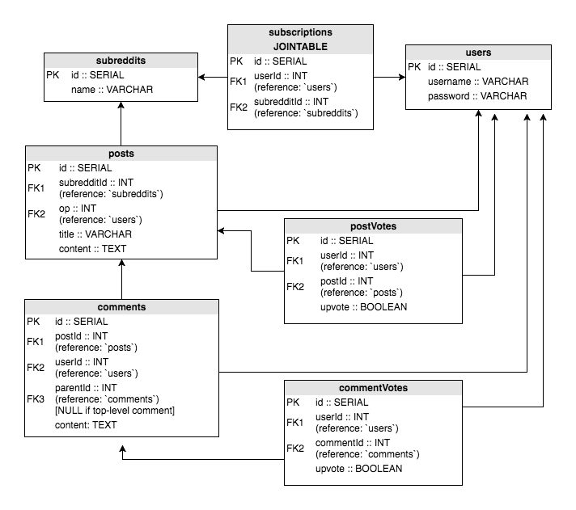

# API Documentation

Any request that fails will be given a response as follows:

Response on failure
```
{
    success: false,
    error: <String>
}
```

## Pull posts
Example `<Post>`
```
{
    id: <Number>,
    title: <String>,
    content: <String>,
    createdAt: <Date>,
    updatedAt: <Date>,
    subredditId: <Number> [may be populated as <Subreddit>],
    op: <Number> [may be populated as <User>]
}
```

### GET /api/post/all
(login _not_ required)
Response on success
```
{
    success: true,
    posts: <Array of Post objects>
}
```

## Authentication
Example `<User>`
```
{
    id: <Number>,
    username: <String>,
    createdAt: <Date>,
    updatedAt: <Date>
}
```
### POST /api/user/login
`req.body`
```
{
    username: <text>,
    password: <text>
}
```
Response on success
```
{
    success: true,
    user: <User object (no password)>
}
```

### POST /api/user/register
`req.body`
```
{
    username: <text>,
    password: <text>
}
```
Response on success
```
{
    success: true,
    user: <User object (no password)>
}
```

## Making and Modifying Posts
### POST /api/post/new
Must be logged in to make a new post
`req.body`
```
{
    title: <String>,
    content: <String>,
    subredditId: <Number>
}
```
